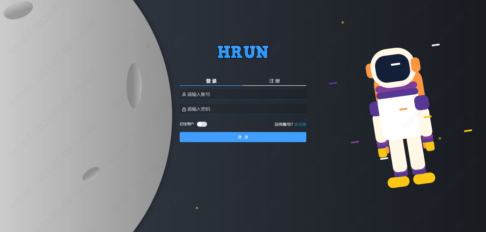
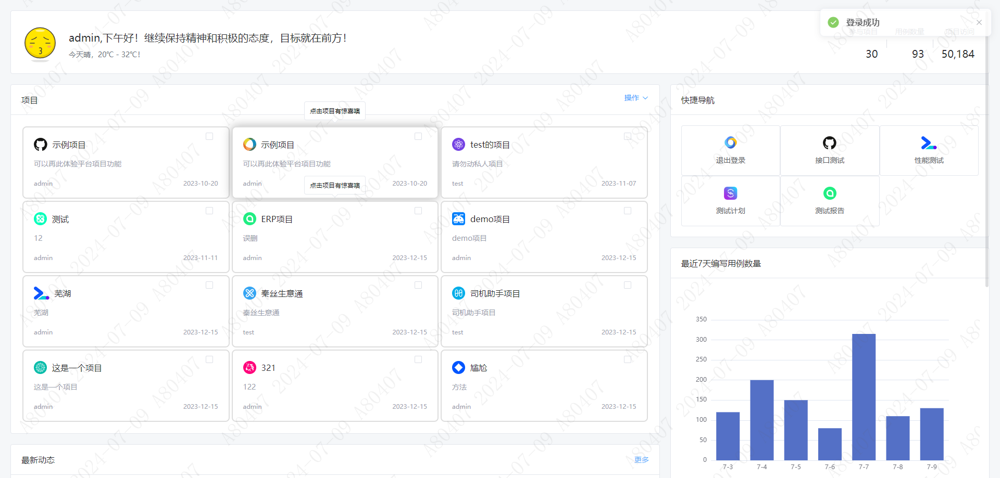
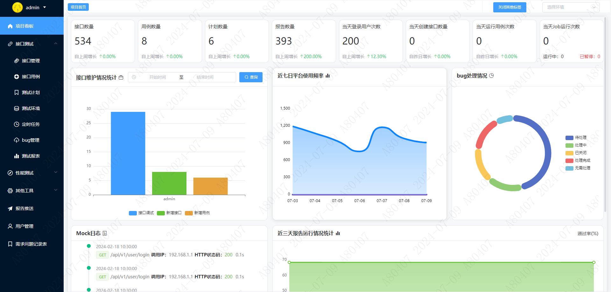
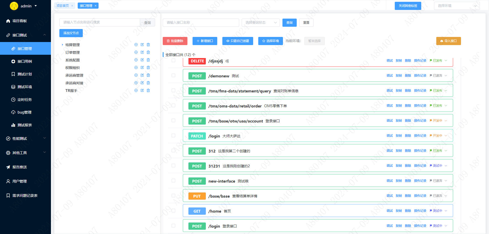
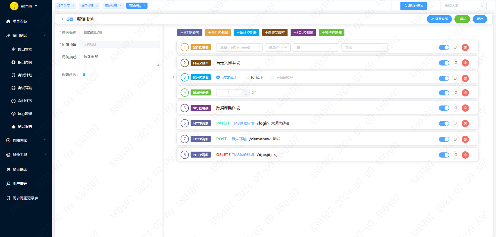
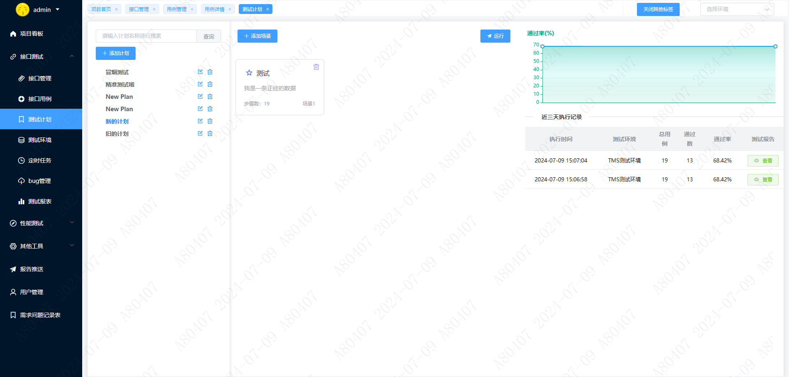

# HRUN测试平台
## 平台地址
- 在线预览
  <a href="http://139.9.38.166:5002/" target="_blank">http://139.9.38.166:5002/</a>

- gitee地址
    <a href="https://gitee.com/hsjtest/hrun" target="_blank">https://gitee.com/hsjtest/hrun</a>

## 🔷backend

#### 软件架构
###### 软件架构说明
```
基于 python3 + Django + celery + mariadb + redis
```

#### 安装教程
###### 手动部署
```
1、创建虚拟环境执行依赖包：pip install -r requirements.txt
2、backend/primaryApp/settings/dev.py或pro.py修改自己的数据库和Redis配置信息
3、数据库迁移：python manage.py makemigrations
4、数据库执行迁移文件：python manage.py migrate
5、运行Django服务：python manage.py runserver
```
###### 自动部署
```
1、服务器中安装docker和docker-compose
2、运行 sh deploy.sh
```
#### 使用说明
###### static配置文件生成
```
python manage.py collectstatic
```
###### 数据库迁移
```
python manage.py makemigrations
```
###### 数据库执行迁移文件
```
python manage.py migrate
```
###### 运行Django服务
```
python manage.py runserver
```


## 🔷frontend

#### 软件架构
###### 软件架构说明
```
基于 js + vue3 + element-plus + echarts
```
###### 安装node.js
```
官网地址：https://nodejs.org/en
```

###### 项目初始化
```
npm install
```

###### 开发或测试环境启动
```
npm run serve
```

###### 生产环境发布打包
```
npm run build
```
#### 目录结构
```
dist -- 存放生产部署打包配置
node_modules -- 项目所需的各种依赖包和模块
public -- 浏览器展示的启动标签等信息
src：
    api -- 存放所有的接口
    assets -- 存放全局的js、css、图片等信息
    components -- 存放公共组件
    plugins -- element的配置文件
    router -- path配置
    store -- 数据共享等配置
    views -- 各个页面的vue代码存放
```
## 瞅一眼吧








## 规划
目前平台还在持续开发中，后续会持续更新，敬请期待！

## 感谢
```
如果觉得好用，请给个star，谢谢！
```
有什么问题，欢迎提issue，联系微信
